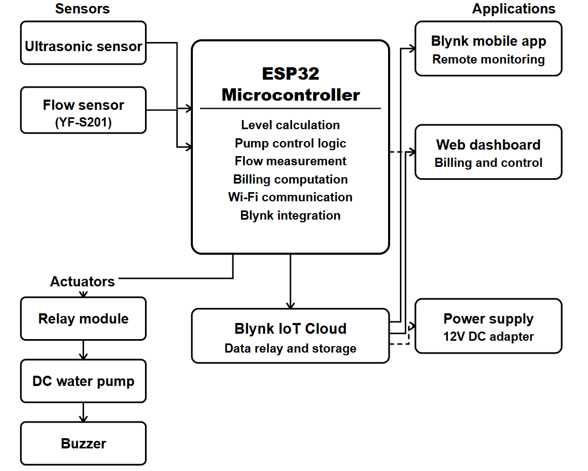

# IoT-Based Smart Water Level Monitoring and Billing System

## Project Overview

Water scarcity and inefficient water management are common problems in residential buildings, hostels, and institutional environments. Manual monitoring of water tanks is often unreliable and leads to problems such as tank overflow, pump dry running, and unnecessary electricity consumption.

This project presents an IoT-based Smart Water Level Monitoring and Billing System that automatically measures water level, controls a water pump, alerts users when the tank reaches a critical level, and estimates water consumption cost using a flow sensor. The system uses an ESP32 microcontroller along with ultrasonic and water flow sensors to collect data and transmit it to a cloud dashboard for near real-time monitoring.

The proposed solution provides a low-cost, scalable, and automated approach for efficient water management.

---

## Key Features

- Near real-time water level monitoring
- Non-contact water level measurement using an ultrasonic sensor
- Automatic pump control using a relay module
- Buzzer alert when the tank reaches a critical level
- Water usage monitoring using a flow sensor
- Approximate water billing calculation
- Cloud-based visualization using Blynk IoT
- Remote monitoring via web/mobile dashboard

---

## System Architecture

The system consists of four main components:

1. **Sensing Layer**
   - Ultrasonic sensor for water level measurement
   - Water flow sensor for consumption measurement

2. **Processing Layer**
   - ESP32 microcontroller for data processing and decision-making

3. **Actuation Layer**
   - Relay module for pump control
   - Buzzer for alert notification

4. **Cloud / Visualization Layer**
   - Blynk IoT platform for data visualization and user interaction



---

## Hardware Components

| Component | Quantity |
|-----------|----------|
| ESP32 Development Board | 1 |
| Ultrasonic Sensor (HC-SR04) | 1 |
| Water Flow Sensor (YF-S201) | 1 |
| Relay Module | 1 |
| Buzzer | 1 |
| Breadboard | 1 |
| Jumper Wires | As needed |
| DC Water Pump | 1 |
| External Power Adapter (12V) | 1 |

---

## Pin Configuration

| Component | ESP32 Pin |
|-----------|----------|
| Ultrasonic TRIG | GPIO 12 |
| Ultrasonic ECHO | GPIO 13 |
| Relay Module | GPIO 14 |
| Buzzer | GPIO 27 |
| Flow Sensor Signal | GPIO 26 |

---

## Software Requirements

- Arduino IDE
- ESP32 Board Support Package
- Blynk IoT Platform

### Required Libraries

- BlynkSimpleEsp32  
- WiFi  
- Wire  

---

## System Workflow

1. ESP32 initializes sensors and network connection  
2. Ultrasonic sensor measures water level  
3. Water level percentage is calculated  
4. Pump control logic is applied:
   - Pump ON when water level is low
   - Pump OFF when water level is high  
5. Buzzer activates when water level reaches critical threshold  
6. Flow sensor measures water flow via pulse generation  
7. Water usage is calculated using a pulse-to-liter conversion  
8. Billing estimation is calculated based on water usage  
9. Data is sent to the Blynk IoT dashboard  
10. The cycle repeats continuously  


---

## Billing Calculation

Water usage is calculated using the following equation:

                Water Usage (Liters) = Pulse Count / 450


The estimated bill is calculated as:

                Bill = Total Water Usage × Price per Liter


The conversion factor of 450 pulses per liter is an assumed average based on the flow sensor specifications.

---

## IoT Dashboard

The Blynk dashboard provides the following information:

- Water level percentage  
- Pump status  
- Water usage (liters)  
- Daily and monthly usage  
- Estimated billing amount  

---

## Installation and Setup

### Step 1: Clone the Repository

```bash
git clone https://github.com/yourusername/smart-water-monitoring-iot.git
```

### Step 2: Install Required Libraries
Install the ESP32 board package and required libraries in the Arduino IDE.

### Step 3: Configure WiFi Credentials
```cpp
char ssid[] = "YOUR_WIFI_NAME";
char pass[] = "YOUR_WIFI_PASSWORD";
```

### Step 4: Add Blynk Authentication Token
```cpp
#define BLYNK_AUTH_TOKEN "YOUR_TOKEN"
```

### Step 5: Upload Code

Upload the program to the ESP32 using Arduino IDE.

### Step 6: Configure Dashboard

Create a Blynk dashboard and add widgets for:

- Water level  
- Pump control  
- Water usage  
- Billing  

---

## Future Work

- Accurate flow sensor calibration using real measurements  
- Leakage detection  
- Data analytics and usage prediction  
- Mobile application development  
- Multi-user support and billing management  

---

## Project Contributors

- Nasrin Akhter Jerin  
- Mysha Tabassum Momo  
- Tasmia Hossain Kashfia  

Department of Computer Science and Engineering  
Ahsanullah University of Science and Technology  
